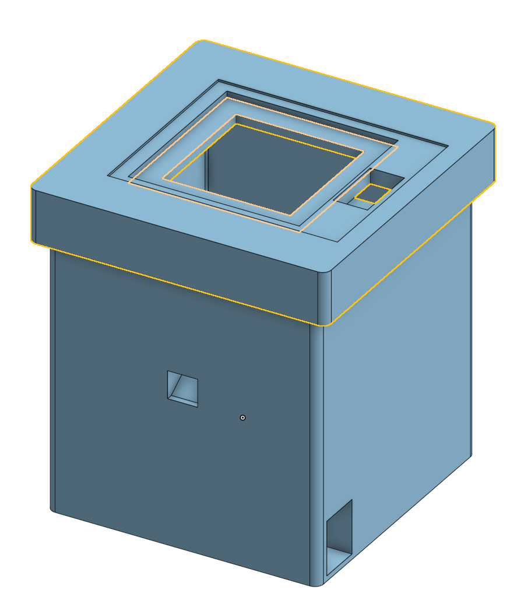
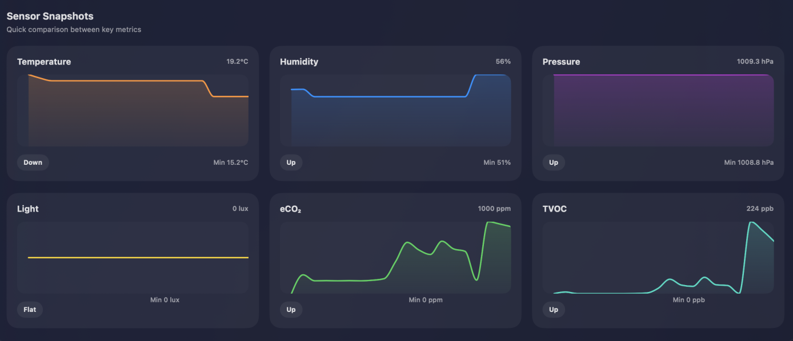

# E10 Environmental Monitoring Project

This project implements a **solar-powered environmental monitoring system** using Arduino, multiple sensors, and EEPROM data logging. It collects and stores temperature, humidity, pressure, light, eCO₂, and TVOC readings at regular intervals. Fun fact - This is my first major group project that spanned a couple of months! Overall I learned a lot from it, and look forward to collaborating with more people.

---

## Components

- **Arduino Uno R3 (Elegoo)**
- **Sensors:**
  - DHT22 — Temperature and humidity
  - BMP280 — Barometric pressure
  - TSL2561 — Light intensity (lux)
  - CCS811 — Air quality (eCO₂, TVOC)
- **Power:**
  - Solar panel with CN3065 solar charger
  - HW-553 5V boost converter
  - 3.7V LiPo battery

---

## Features

- **Data Logging**
  - Records up to 39 entries in Arduino EEPROM. (Electrically Erasable Programmable Read-Only Memory)
  - Stores timestamp, temperature (°C), humidity (%), pressure (hPa), light (lux), eCO₂ (ppm), and TVOC (ppb).

- **Low-Power Operation**
  - Sleeps between readings using the LowPower library to conserve battery.
  - Configurable sample interval (default: 30 minutes).

- **Serial Interface**
  - Commands for data management:
    - `EXPORT` — Outputs stored data as JSON.
    - `CLEAR` — Clears EEPROM records.
    - `COUNT` — Shows number of stored records.

- **Sensor Configuration**
  - Auto ranges for TSL2561 light sensor.
  - Environmental data set for CCS811 for accurate air quality readings.

---

## Usage

1. Connect Arduino and sensors according to the wiring diagram.
2. Upload the code to the Arduino using the Arduino IDE.
3. Open Serial Monitor (9600 baud) to send commands or monitor logs.
4. System automatically records data at defined intervals and stores it in EEPROM.
5. Export data to JSON for analysis using `EXPORT`.

---

## Wiring Diagram

---

## 3D-Printed Enclosure

[3D Enclosure 2](image32131231231.png)

---

## Sample Dashboard Snapshots

These images show the recorded sensor data over time.

---

## Applications

- Environmental monitoring in classrooms, labs, or greenhouses
- Data logging for analysis and visualization
- Portable solar-powered deployment for remote locations

---

## Notes

- Make sure to configure sensor libraries and addresses correctly in the Arduino code.
- EEPROM stores a maximum of 39 records; older records are not overwritten automatically.
- System is optimized for low-power operation and can run on solar power with periodic sunlight.
